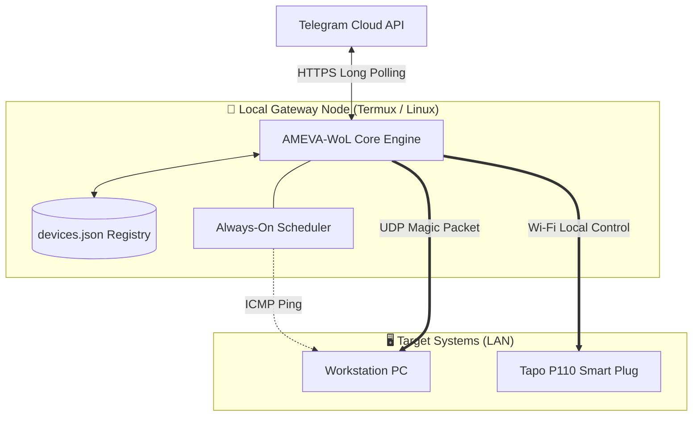

<div align="center">
  <h1>🚀 AMEVA-WoL Gateway</h1>
  <p><strong>Lightweight, Secure Telegram-Controlled Wake-on-LAN & Smart Plug Gateway</strong></p>
  <p><i>Tailored for Android (Termux) & Linux</i></p>
</div>

---

## 🌟 Overview

AMEVA-WoL is an unprivileged Wake-on-LAN (WoL) and Smart Plug control gateway. It operates strictly via outbound Telegram Bot API long polling—meaning **zero inbound network ports, no HTTP listeners, and no router port forwarding required**.

With the new **Tapo P110 Smart Plug integration**, you can now physically control power and monitor energy usage right from Telegram!

📖 For step-by-step bot creation and setup, consult our [Telegram Setup Guide](docs/telegram_setup_guide.md).

---

## ✨ Key Features

- 🔋 **Smart Plug Control**: Natively integrates with TP-Link Tapo (P110) to turn devices on/off, reboot, and check live power consumption.
- 🪶 **Low Overhead**: Idle CPU footprint < 0.1%, RAM consumption ~25–40 MB. Perfect for old Android phones!
- 🛡️ **Zero Inbound Exposure**: Outbound long polling over HTTPS eliminates public IP requirements.
- 🔒 **Ironclad Security**:
  - Commands restricted to whitelisted Telegram `ALLOWED_USER_IDS` and `ALLOWED_CHAT_IDS`.
  - Secret tokens are dynamically redacted from logs.
  - Unprivileged execution (No root/sudo needed).
- 🔄 **Always-On Monitoring**: Optional background scheduler pings your PCs and sends WoL packets automatically if they go offline.

---

## 🏗️ Architecture



---

## 🚀 Quick Start

### 📱 1. Termux (Android) 왕초보 가이드 (복사&붙여넣기)

**1단계: 패키지 설치 및 소스코드 다운로드**
```bash
pkg update -y && pkg upgrade -y
pkg install python git -y

git clone https://github.com/uno-km/AMEVA-WoL.git
cd AMEVA-WoL

python -m venv .venv
source .venv/bin/activate

pip install --upgrade pip
pip install -r requirements.txt
```

**2단계: 환경설정(.env) 세팅**
아래 상자 안의 봇 토큰과 내 ID를 넣고 복사/붙여넣기 하세요. Tapo 플러그가 없다면 관련 줄은 비워둬도 됩니다.

```bash
cat << 'EOF' > .env
TELEGRAM_BOT_TOKEN=여기에_봇_토큰_입력
ALLOWED_USER_IDS=여기에_내_텔레그램_ID_입력
DEFAULT_BROADCAST=192.168.0.255
DEFAULT_WOL_PORT=9

# Tapo Smart Plug 설정 (선택사항)
TAPO_EMAIL=your_email@example.com
TAPO_PASSWORD=your_password
TAPO_DEVICES=p110:192.168.0.5
EOF
```

**3단계: 봇 실행**
```bash
python -m ameva_wol
```

---

## 🛠️ Command Reference

| Command | Syntax | Description |
| :--- | :--- | :--- |
| **`/start`** | `/start` | 🟢 Check authorization and bot status |
| **`/wake`** | `/wake [alias\|all]` | ⚡ Send Wake-on-LAN Magic Packet |
| **`/power`** | `/power <on\|off\|re\|status> [alias]`| 🔌 Control Tapo Smart Plug (ON/OFF/Reboot/Energy Status) |
| **`/status`** | `/status [alias\|all]` | 🔍 Ping devices to check if they are online |
| **`/add`** | `/add <alias> <mac> [ip]` | ➕ Register a new PC for WoL |
| **`/list`** | `/list` | 📋 List all registered devices |
| **`/remove`**| `/remove <alias>` | 🗑️ Delete a device from registry |
| **`/host`** | `/host` | 📊 View Gateway phone/server stats (CPU, RAM, Network) |
| **`/how`** | `/how` | 📖 Read detailed user manual |

---

## ⚙️ Advanced Execution Modes

- **Default Mode** (Telegram commands only):
  ```bash
  python -m ameva_wol
  ```
- **Always-On Mode** (Polling + 5-minute periodic ping & keep-alive wake):
  ```bash
  python -m ameva_wol --always-on 5
  ```

---

## 📄 License
MIT License. See [LICENSE](LICENSE) for details.
